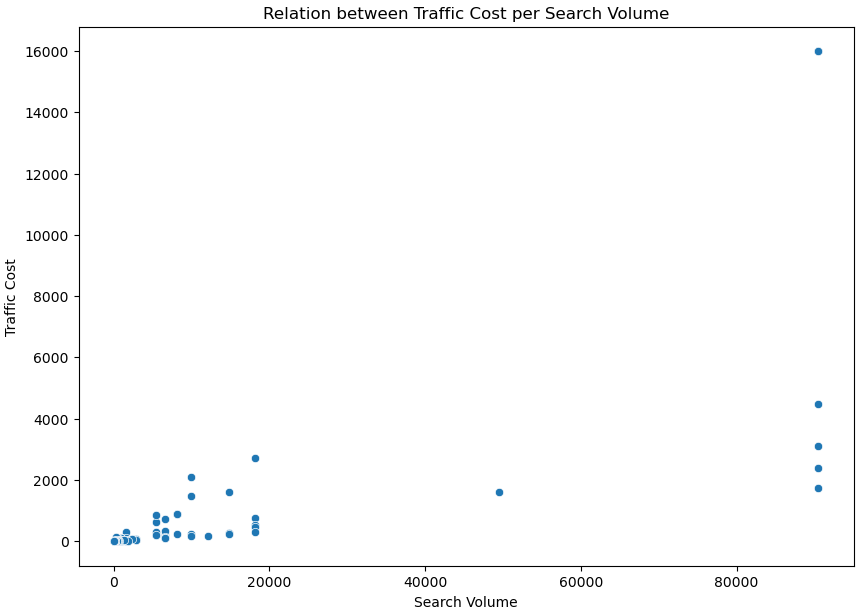

# 🚀 Website Traffic Clustering Project

## 📝 Overview

This project performs an unsupervised machine learning analysis on website traffic data using **K-Means Clustering**. The primary goal is to identify patterns or clusters in the relationship between **Search Volume** and **Traffic Cost**.

The project is implemented using **Python**, with the analysis conducted in a **Jupyter Notebook**.

---

## 📑 Table of Contents

1. [📌 Introduction](#introduction)
2. [🛠 Technologies & Libraries Used](#technologies--libraries-used)
3. [📥 Data Loading & Exploration](#data-loading--exploration)
4. [📊 Data Visualization](#data-visualization)
5. [🔍 K-Means Clustering](#k-means-clustering)
6. [📈 Elbow Method for Optimal Clusters](#elbow-method-for-optimal-clusters)
7. [🎨 Cluster Visualization](#cluster-visualization)
8. [▶️ How to Run](#how-to-run)
9. [✅ Conclusion](#conclusion)

---

## 📌 Introduction

This notebook focuses on analyzing website traffic data to understand the relationship between:

* **🔎 Search Volume**: The number of times a keyword is searched.
* **💰 Traffic Cost**: The estimated cost of generating traffic for the keyword.

The aim is to group the data into clusters based on these two features.

---

## 🛠 Technologies & Libraries Used

| Technology                       | Description                                 |
| -------------------------------- | ------------------------------------------- |
| 🐍 **Python** (Jupyter Notebook) | Programming language & interactive analysis |
| 🐼 **Pandas**                    | Data manipulation & analysis                |
| 🔢 **NumPy**                     | Numerical computing                         |
| 📊 **Matplotlib**                | Data visualization                          |
| 🎨 **Seaborn**                   | Statistical data visualization              |
| 🤖 **scikit-learn**              | Machine learning algorithms                 |

---

## 📥 Data Loading & Exploration

* The dataset (`website_traffic_data.csv`) is loaded using **Pandas**.
* Basic exploratory data analysis (`head()`, `info()`, `describe()`) is performed to understand the structure and summary statistics of the data.

```python
import os
os.environ["OMP_NUM_THREADS"] = "1"

import pandas as pd
import numpy as np
import matplotlib.pyplot as plt
import seaborn as sns
from sklearn.cluster import KMeans

wtd = pd.read_csv('website_traffic_data.csv')
wtd.head(10)
```
---

## 📊 Data Visualization

* A **scatter plot** is created using **Seaborn** and **Matplotlib** to visualize the relationship between **Search Volume** and **Traffic Cost**.
* This helps in visually inspecting possible natural clusters.

```python
plt.figure(figsize=(10,7))
sns.scatterplot(data=wtd,x='Search Volume',y='Traffic Cost')
plt.xlabel('Search Volume')
plt.ylabel('Traffic Cost')
plt.title('Relation between Traffic Cost per Search Volume')
plt.show()
```

---

## 🔍 K-Means Clustering

* The two key features (**Search Volume** and **Traffic Cost**) are selected and converted into a 2D array for clustering.
* **K-Means clustering** from **scikit-learn** is applied to group the data.

---

## 📈 Elbow Method for Optimal Clusters

* The **Elbow Method** is used to find the optimal number of clusters by plotting clustering inertia scores for cluster counts from 1 to 10.
* The "elbow point" suggests that **2 clusters** is a good choice.

---

## 🎨 Cluster Visualization

* K-Means clustering is run with **2 clusters**.
* Cluster labels are added to the dataset.
* A scatter plot is created to visualize the clusters:

  * **Cluster 0**: 🔵 Blue
  * **Cluster 1**: 🟢 Green
  * **Cluster Centroids**: ⭐ Red stars

---

## ▶️ How to Run

1. Clone this repository.
2. Open the `.ipynb` file in **Jupyter Notebook**.
3. Install the required libraries:

```bash
pip install pandas numpy matplotlib seaborn scikit-learn
```

4. Run the notebook cells step-by-step.

---

## ✅ Conclusion

* The clustering reveals distinct groupings in the data based on **Search Volume** and **Traffic Cost**.
* Visualizations help in understanding the separation and central points of the clusters.

---

## 👤 About Me

Hi, I'm Hemant, a data enthusiast passionate about turning raw data into meaningful business insights.

📫 **Let’s connect:**  
- GitHub : [GitHub Profile](https://github.com/hemant1491)
- LinkedIn : [LinkedIn Profile](https://www.linkedin.com/in/hemant1491/)  
- Email : hemant0452@outlook.com

---
